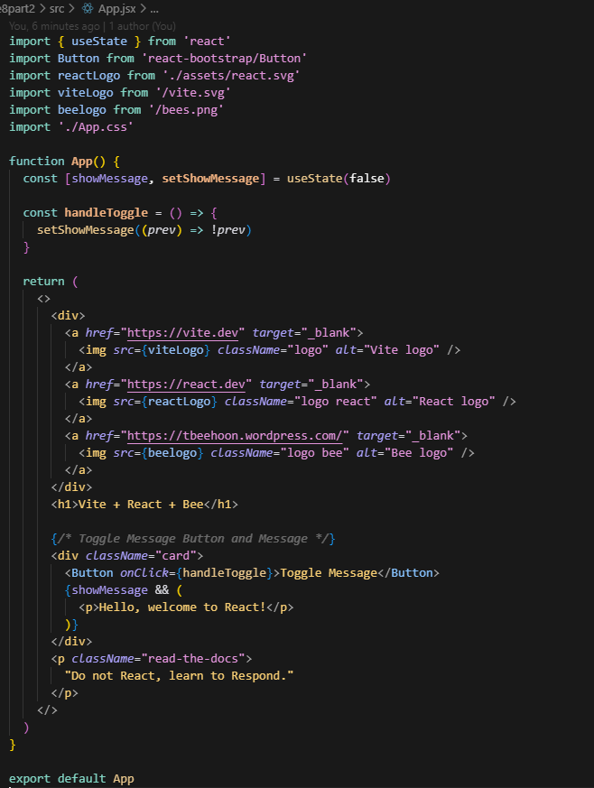
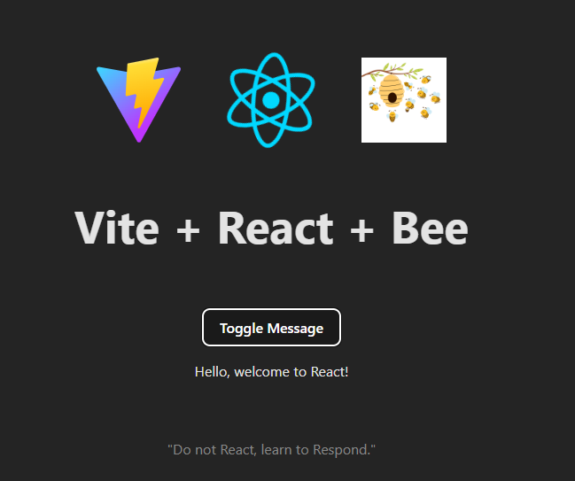
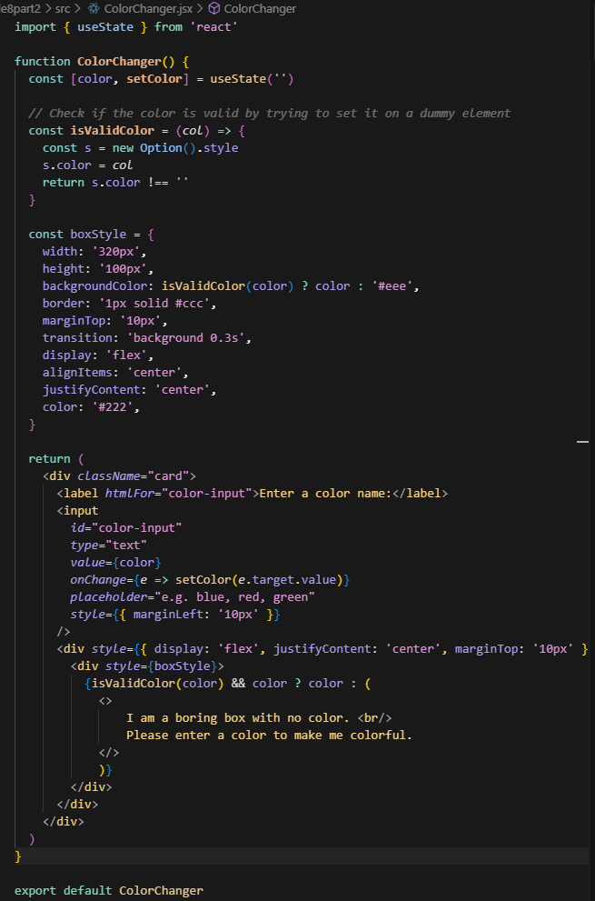
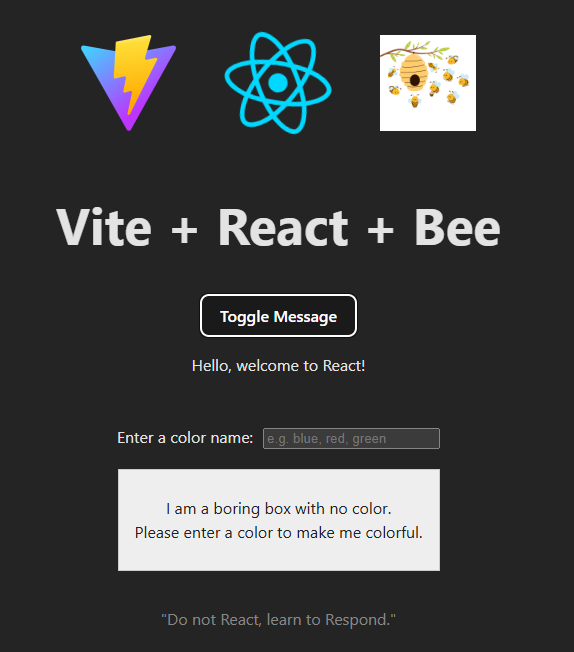
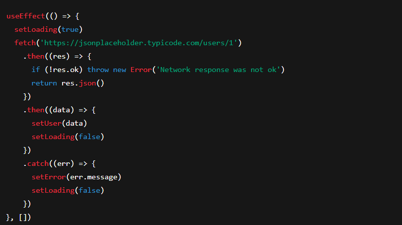
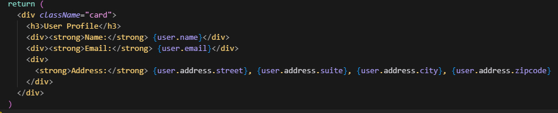
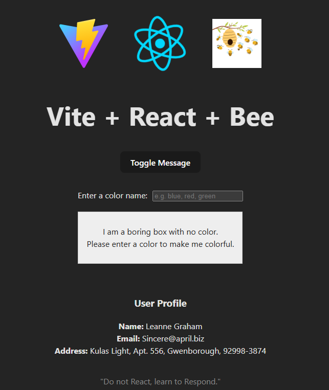
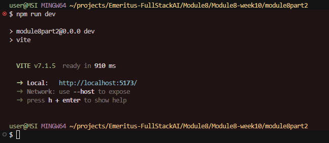
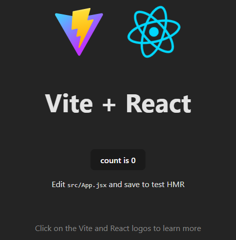

# NVM, React and Vite

Compiled  by Tan Bee Hoon (contact: tbeehoon@gmail), dated 15 Sep 2025

This readme shows: 

1. Task1 - Handling Events in React

2. Task2 - State Management using React Hooks

3. Task3 - Asynchronous Data Fetching with AJAX

4. Reference - Github Repo 

5. How to set up the environment for NVM, React and Vite.

   

## 1. Task1-Handling Events in React

> [!NOTE]
>
> Requirements:
>
> a) Create a simple component with a button labeled “Toggle Message.” 
>
> b) When the button is clicked, toggle a message on the screen that says “Hello, welcome to React!” This message should disappear when the button is clicked again.


### 1.1. Explanation

The file App.jsx is modified to complete the task:

a. Created a `<Button onClick={handleToggle}>Toggle Message</Button>` inside component App

b. The button is labelled “Toggle Message”

c. Using a state variable `showMessage` (`useState(false)`) to keep track of whether the message should be visible

d. The `handleToggle` function flips the value of `showMessage` each time the button is clicked.

e. Conditionally render the message, which ensures the message appears when `showMessage` is true and disappears when it’s false.

```
{showMessage && (
  <p>Hello, welcome to React!</p>
)}
```


### 1.2 Code for App.jsx

The code for the full App.jsx is as follows:



```
import { useState } from 'react'
import Button from 'react-bootstrap/Button'
import reactLogo from './assets/react.svg'
import viteLogo from '/vite.svg'
import beelogo from '/bees.png'
import './App.css'

function App() {
  const [showMessage, setShowMessage] = useState(false)

  const handleToggle = () => {
    setShowMessage((prev) => !prev)
  }

  return (
    <>
      <div>
        <a href="https://vite.dev" target="_blank">
          
        </a>
        <a href="https://react.dev" target="_blank">
          
        </a>
        <a href="https://tbeehoon.wordpress.com/" target="_blank">
          
        </a>
      </div>
      <h1>Vite + React + Bee</h1>
      
      {/* Toggle Message Button and Message */}
      <div className="card">
        <Button onClick={handleToggle}>Toggle Message</Button>
        {showMessage && (
          <p>Hello, welcome to React!</p>
        )}
      </div>
      <p className="read-the-docs">
        "Do not React, learn to Respond."
      </p>
    </>
  )
}

export default App
```


### 1.3 Output 

Run the code:

```
npm run dev
```

The following is the resulting browser screen capture:




---

## 2. Task2-State Management using React Hooks

> [!NOTE]
>
> Requirements: 
>
> a) Build a component called ColorChanger. This component should have a text input where users can enter a colour name (e.g., “blue”). 
>
> b) The component should display a box that changes colour based on the input. 
>
> c) As the user types into the input, the box should automatically update to the new colour if it’s a valid colour name. 

Two files are modified to complete the task:

### 2.1 Explanation 

#### **2.1.1 `App.jsx` – The Main Application Component**

App.jsx is setup to "frame" the app, and import in ColorChange as a child component, 

a. Import custom **ColorChanger**

```
import ColorChanger from './ColorChanger'
```

b. Render ColorChanger Component inside the styled card.

```
{/* ColorChanger Component */}
<div className="card" style={{ marginTop: 0 }}>
	<ColorChanger />
</div>
```


#### **2.1.2 ColorChanger.jsx** - Interactive Color Nox 

This the component for the interactive color box. 

a. Start with State Management. The **color** variable stores the user input, initiated as empty (' ').

```
const [color, setColor] = useState('')
```


b. The color validation is done with variable **isValidColor**.  It creates a temporary DOM style object and tries to set its `color`. If the browser recognizes the input (like `"red"`, `"#00ff00"`, or `"rgb(0,0,255)"`), it will be set. If it’s invalid, it will remain empty.

```
const isValidColor = (col) => {
  const s = new Option().style
  s.color = col
  return s.color !== ''
}
```


c. The color box is styled with the the following: 

* The main box is **320×100px**.

* Background is user’s chosen color if valid. A dull grey (`#eee`) if not.

* Centered text with background transitions.

  ```
  const boxStyle = {
    width: '320px',
    height: '100px',
    backgroundColor: isValidColor(color) ? color : '#eee',
    border: '1px solid #ccc',
    marginTop: '10px',
    transition: 'background 0.3s',
    display: 'flex',
    alignItems: 'center',
    justifyContent: 'center',
    color: '#222',
  }
  ```


d. Rendering Logic is defined in two steps:

Step1 - User types a color name (like `"red"`) or a CSS color value. Updates the `color` state on change.

```
<input
    id="color-input"
    type="text"
    value={color}
    onChange={e => setColor(e.target.value)}
    placeholder="e.g. blue, red, green"
    style={{ marginLeft: '10px' }}
/>
```

Step2 - If the color is valid and not empty, displays the color’s name inside the box. Otherwise shows the default message.

```
<div style={{ display: 'flex', justifyContent: 'center', marginTop: '10px' }}>
    <div style={boxStyle}>
      {isValidColor(color) && color ? color : (
        <> 
            I am a boring box with no color. <br/> 
            Please enter a color to make me colorful.
        </>
        )}
    </div>
</div>
```


### 2.2 Code for ColorChanger.jsx

The full code for ColorChanger.jsx is as follows:



```
import { useState } from 'react'

function ColorChanger() {
  const [color, setColor] = useState('')

  // Check if the color is valid by trying to set it on a dummy element
  const isValidColor = (col) => {
    const s = new Option().style
    s.color = col
    return s.color !== ''
  }

  const boxStyle = {
    width: '320px',
    height: '100px',
    backgroundColor: isValidColor(color) ? color : '#eee',
    border: '1px solid #ccc',
    marginTop: '10px',
    transition: 'background 0.3s',
    display: 'flex',
    alignItems: 'center',
    justifyContent: 'center',
    color: '#222',
  }

  return (
    <div className="card">
      <label htmlFor="color-input">Enter a color name:</label>
      <input
        id="color-input"
        type="text"
        value={color}
        onChange={e => setColor(e.target.value)}
        placeholder="e.g. blue, red, green"
        style={{ marginLeft: '10px' }}
      />
      <div style={{ display: 'flex', justifyContent: 'center', marginTop: '10px' }}>
        <div style={boxStyle}>
          {isValidColor(color) && color ? color : (
            <> 
                I am a boring box with no color. <br/> 
                Please enter a color to make me colorful.
            </>
            )}
        </div>
      </div>
    </div>
  )
}

export default ColorChanger
```


### 2.3 Output

Run the code:

```
npm run dev
```

The resulting browser screen is shown below:



---

## 3. Task3-Asynchronous Data Fetching with AJAX 

> [!NOTE]
>
> Requirements: 
>
> a) Create a UserProfile component that fetches user data from an API (for example, https://jsonplaceholder.typicode.com/users/1) and displays the user’s name, email, and address on the page. 
>
> b) Display a loading message while data is being fetched. 


### 3.1 Explanation

Two files are modified to complete the task:

#### 3.1.1 `App.jsx` – The Main Application Component

**App.jsx** is setup to "frame" the app, and import in **UserProfile** as a child component, 

a. Import custom **UserProfile **

```
import UserProfile from './UserProfile'
```

b. Render **UserProfile** Component inside the styled card.

```
{/* UserProfile Component */}
<div className="card" style={{ marginTop: 0 }}>
	<UserProfile />
</div>
```


#### 3.1.2 `UserProfile.jsx` – Fetching and Displaying User Data

This component demonstrates how to fetch asynchronous data in React using the `useEffect` and `useState` hooks. It loads a fake user profile from the public API **`https://jsonplaceholder.typicode.com/users/1`** and displays the user’s information.

##### a.  **State Management**

The component manages three pieces of state:

- **`user`** : holds the fetched user data (initially `null`).
- **`loading`** : a boolean that tracks whether the fetch is in progress (initially `true`).
- **`error`** : stores any error message if the fetch fails (initially `null`).

```
 const [user, setUser] = useState(null)
 const [loading, setLoading] = useState(true)
 const [error, setError] = useState(null)
```

##### b. **Data Fetching with `useEffect`**

The `useEffect` hook triggers when the component mounts. The process:

* Set `loading` to `true` before fetching.
* Use `fetch` to call the API.
* If the response is OK, convert it to JSON and update `user`.
* If the response is invalid, throw an error.
* Catch any errors, set `error`, and stop loading.

```
useEffect(() => {
	setLoading(true)
	fetch('https://jsonplaceholder.typicode.com/users/1')
      .then((res) => {
        if (!res.ok) throw new Error('Network response was not ok')
        return res.json()
      })
      .then((data) => {
        setUser(data)
        setLoading(false)
      })
      .catch((err) => {
        setError(err.message)
        setLoading(false)
      })
}, [])
```




##### c. **Conditional Rendering**

The component displays different UI states based on the fetch status:

- If `loading` then Show *“Loading user profile…”*
- If `error` then Show the error message
- if `!user` then Return null, meaning don't render anything for this component
- If `user` is available then Render the profile details (refer to next section)

```
if (loading) return <div className="card">Loading user profile...</div>
if (error) return <div className="card">Error: {error}</div>
if (!user) return null
```


##### **d. Display User Data**

Once the API returns data, the component displays the user’s **name**, **email**, and **full address** inside a styled card.

```
return (
    <div className="card">
      <h3>User Profile</h3>
      <div><strong>Name:</strong> {user.name}</div>
      <div><strong>Email:</strong> {user.email}</div>
      <div>
        <strong>Address:</strong> {user.address.street}, {user.address.suite}, {user.address.city}, {user.address.zipcode}
      </div>
    </div>
  )
```



### 3.2 Code for UserProfile.jsx

The full code for **UserProfile.jsx** is as follows:

```
import { useEffect, useState } from 'react'

function UserProfile() {
  const [user, setUser] = useState(null)
  const [loading, setLoading] = useState(true)
  const [error, setError] = useState(null)

  useEffect(() => {
    setLoading(true)
    fetch('https://jsonplaceholder.typicode.com/users/1')
      .then((res) => {
        if (!res.ok) throw new Error('Network response was not ok')
        return res.json()
      })
      .then((data) => {
        setUser(data)
        setLoading(false)
      })
      .catch((err) => {
        setError(err.message)
        setLoading(false)
      })
  }, [])

  if (loading) return <div className="card">Loading user profile...</div>
  if (error) return <div className="card">Error: {error}</div>
  if (!user) return null

  return (
    <div className="card">
      <h3>User Profile</h3>
      <div><strong>Name:</strong> {user.name}</div>
      <div><strong>Email:</strong> {user.email}</div>
      <div>
        <strong>Address:</strong> {user.address.street}, {user.address.suite}, {user.address.city}, {user.address.zipcode}
      </div>
    </div>
  )
}

export default UserProfile
```


### 3.3 Output

Run the code:

```
npm run dev
```

The resulting browser screen is shown below:




## 4. Reference - Git Hub Repo 

Final git push for module8part2 app is pushed to the following github repo: 

https://github.com/tbeehoon/module8part2/tree/main


---


## 5. How to set up the environment

### 5.1 Install NVM (Node Version Manager) 

If NVM is not installed yet, download the latest `nvm-setup.exe` from the releases page: https://github.com/coreybutler/nvm-windows/releases

> [!TIP]
>
> Avoid installing the “global” Node.js from nodejs.org if using NVM. 


### 5.2 Install Node.js via NVM and set a default

Install the version required (LTS recommended):

```
# Install latest LTS
nvm install lts

# Use it now
nvm use lts
```

Do verification:

```
# Verify
node -v
npm -v
```


### 5.3 Create a new React app with Vite

From any workspace folder in your terminal:

```
npm create vite@latest module8part2
```


Then install dependencies and run the dev server:

```
cd my-app
npm install
npm run dev
# Vite typically starts at http://localhost:5173
```

> [!TIP]
>
> Ctl-C to exit



The following is the default browser screen upon installation:



### 5.4 Add Bootstrap to the React project (Optional)

Install Bootstrap and its dependencies:

```
npm install bootstrap react-bootstrap
```

Import Bootstrap styles in src/main.jsx` (or `src/main.tsx` for TypeScript):

```
import 'bootstrap/dist/css/bootstrap.min.css'
```

Ready to use Bootstrap classes and React-Bootstrap components in app.

Example in `App.jsx`:

```
import Button from 'react-bootstrap/Button'

function App() {
return (
<div className="p-4">
    <h1>Hello, Bootstrap + React + Vite!</h1>
    <Button variant="primary">Click Me</Button>
</div>
)
}

export default App
```


### 5.5 Add Routing to the React project (Optional)

Install Router and its dependencies:

```
npm install react-router-dom
```

Ready to use React Routing in app.

Example in `App.jsx`:

```
import { BrowserRouter as Router, Routes, Route, Link } from "react-router-dom";
import Home from "./Home";
import About from "./About";

function App() {
  return (
    <Router>
      <nav>
        <Link to="/">Home</Link> | <Link to="/about">About</Link>
      </nav>
      <Routes>
        <Route path="/" element={<Home />} />
        <Route path="/about" element={<About />} />
      </Routes>
    </Router>
  );
}

export default App;
```


### 5.5 Initialize Git

Version control the project using Git.

```
# Initialize a git repository
git init

# Add all project files
git add .

# Commit the files
git commit -m "Initial commit: setup project"
```

To add to Github.

```
# Add remote 
git remote add origin https://github.com/tbeehoon/module8part2.git

# Push changes
git branch -M main
git push -u origin main
```

> [!TIP]
>
> In case identity need to be authenticated:

```
git config --global user.email "you@example.com"
git config --global user.name "Your Name"
```


### 5.6 Setup .gitignore

Add a `.gitignore` file in the root of the project to exclude files and folders not required in version control. Some examples of items to include:

```
# dependencies
/node_modules

# production build
/dist

# logs
npm-debug.log*
*.log

# environment variables
.env
.env.local
.env.*.local

# IDE/editor folders
.vscode/
.DS_Store

# Vite cache
.vite/
```

---


@Q.E.D.