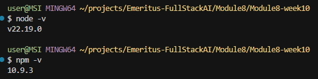

# NVM, React and Vite

Compiled  by Tan Bee Hoon (contact: tbeehoon@gmail)

This readme shows: 

1. Task1 - Handling Events in React

2. Task2 - **Set Up a Basic React Environment**

3. Task3 - **Create and Render Functional Components**

4. Task4 - **Use JSX for Structuring Components** 

5. How to set up the environment for NVM, React and Vite.

   

## 1. Handling Events in React

> [!NOTE]
>
> Requirements:
>
> a) Create a simple component with a button labeled “Toggle Message.” 
>
> b) When the button is clicked, toggle a message on the screen that says “Hello, welcome to React!” This message should disappear when the button is clicked again.


The file App.jsx is modified to complete the task:

a. Created a `<Button onClick={handleToggle}>Toggle Message</Button>` inside component App

b. The button is labelled “Toggle Message”

c. Using a state variable `showMessage` (`useState(false)`) to keep track of whether the message should be visible

d. The `handleToggle` function flips the value of `showMessage` each time the button is clicked.

e. Conditionally render the message, which ensures the message appears when `showMessage` is true and disappears when it’s false.

```
{showMessage && (
  <p>Hello, welcome to React!</p>
)}
```

The code for the full App.jsx is as follows:


```
import { useState } from 'react'
import Button from 'react-bootstrap/Button'
import reactLogo from './assets/react.svg'
import viteLogo from '/vite.svg'
import beelogo from '/bees.png'
import './App.css'

function App() {
  const [showMessage, setShowMessage] = useState(false)

  const handleToggle = () => {
    setShowMessage((prev) => !prev)
  }

  return (
    <>
      <div>
        <a href="https://vite.dev" target="_blank">
          
        </a>
        <a href="https://react.dev" target="_blank">
          
        </a>
        <a href="https://tbeehoon.wordpress.com/" target="_blank">
          
        </a>
      </div>
      <h1>Vite + React + Bee</h1>
      
      {/* Toggle Message Button and Message */}
      <div className="card">
        <Button onClick={handleToggle}>Toggle Message</Button>
        {showMessage && (
          <p>Hello, welcome to React!</p>
        )}
      </div>
      <p className="read-the-docs">
        "Do not React, learn to Respond."
      </p>
    </>
  )
}

export default App
```

The following is the resulting browser screen capture:


---

### 4. Task 4 - **Use JSX for Structuring Components ** 

Required task details: 

a) Create a component that renders a list of items (using an unordered list) and a heading (e.g., "My To-Do List"). 

b) The component should display at least three items in the list using JSX. 

The 4 files are modified to complete the task:

a. **GreetingComponent**: using the same  file (src/GreetingComponent.jsx) that returns a simple JSX element with slight modification. 

b. **TodoList**: create a new file (src/TodoList.jsx) that contains the TodoList component and exports it as default. Also, use React-Bootstrap components for layout.


c. **App.jsx**: Imports and renders both GreetingComponent and TodoList. 


d. **main.jsx**: renders only the App component as the root of your application.

This makes App the main entry point for the UI, and all other components are organized and rendered through it. 

Also the import of Bootstrap CSS is in src/main.jsx at the very top. This makes Bootstrap styles available globally in the app.


e. **index.html**: Not much change the in this file, only slight change to update the title and the favicon 


f. run the command "**npm run dev**" and check output. 


g. Final git push for todolist app is pushed to the following github repo: 

https://github.com/tbeehoon/todo-app/tree/main


---


## 5. How to set up the environment

### 5.1 Install NVM (Node Version Manager) 

If NVM is not installed yet, download the latest `nvm-setup.exe` from the releases page: https://github.com/coreybutler/nvm-windows/releases

> [!TIP]
>
> Avoid installing the “global” Node.js from nodejs.org if using NVM. 


### 5.2 Install Node.js via NVM and set a default

Install the version required (LTS recommended):

```
# Install latest LTS
nvm install lts

# Use it now
nvm use lts
```

Do verification:

```
# Verify
node -v
npm -v
```



### 5.3 Create a new React app with Vite

From any workspace folder in your terminal:

```
npm create vite@latest module8part2
```


Then install dependencies and run the dev server:

```
cd my-app
npm install
npm run dev
# Vite typically starts at http://localhost:5173
```

> [!TIP]
>
> Ctl-C to exit


The following is the default browser screen upon installation:


### 5.4 Add Bootstrap to the React project (Optional)

Install Bootstrap and its dependencies:

```
npm install bootstrap react-bootstrap
```

Import Bootstrap styles in src/main.jsx` (or `src/main.tsx` for TypeScript):

```
import 'bootstrap/dist/css/bootstrap.min.css'
```

Ready to use Bootstrap classes and React-Bootstrap components in app.

Example in `App.jsx`:

```
import Button from 'react-bootstrap/Button'

function App() {
return (
<div className="p-4">
    <h1>Hello, Bootstrap + React + Vite!</h1>
    <Button variant="primary">Click Me</Button>
</div>
)
}

export default App
```


### 5.5 Add Routing to the React project (Optional)

Install Router and its dependencies:

```
npm install react-router-dom
```

Ready to use React Routing in app.

Example in `App.jsx`:

```
import { BrowserRouter as Router, Routes, Route, Link } from "react-router-dom";
import Home from "./Home";
import About from "./About";

function App() {
  return (
    <Router>
      <nav>
        <Link to="/">Home</Link> | <Link to="/about">About</Link>
      </nav>
      <Routes>
        <Route path="/" element={<Home />} />
        <Route path="/about" element={<About />} />
      </Routes>
    </Router>
  );
}

export default App;
```


### 5.5 Initialize Git

Version control the project using Git.

```
# Initialize a git repository
git init

# Add all project files
git add .

# Commit the files
git commit -m "Initial commit: setup project"
```

To add to Github.

```
# Add remote 
git remote add origin https://github.com/tbeehoon/module8part2.git

# Push changes
git branch -M main
git push -u origin main
```

> [!TIP]
>
> In case identity need to be authenticated:

```
git config --global user.email "you@example.com"
git config --global user.name "Your Name"
```


### 5.6 Setup .gitignore

Add a `.gitignore` file in the root of the project to exclude files and folders not required in version control. Some examples of items to include:

```
# dependencies
/node_modules

# production build
/dist

# logs
npm-debug.log*
*.log

# environment variables
.env
.env.local
.env.*.local

# IDE/editor folders
.vscode/
.DS_Store

# Vite cache
.vite/
```

---


@Q.E.D.